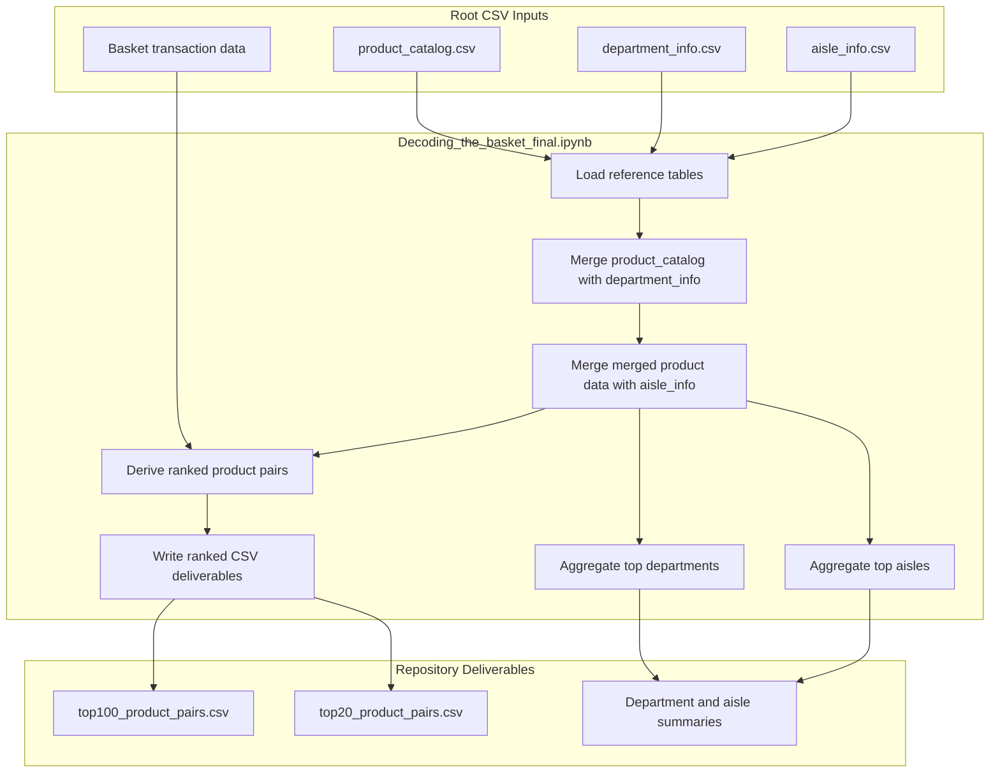
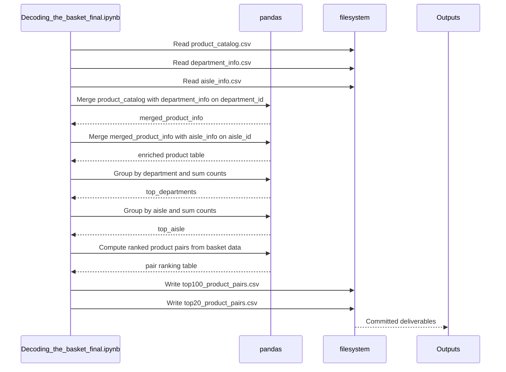

# Analytical Workflow and Repository Contract - End-to-end Basket Decoding Pipeline

## Overview

This repository is organized around a single notebook, `Decoding_the_basket_final.ipynb`, that performs the basket-decoding analysis end to end from repository-root CSV assets. The workflow combines product reference data with basket-level transaction data to produce human-readable product, department, and aisle rankings, then preserves ranked pair outputs as committed CSV deliverables.

The repository contract is intentionally simple: the notebook expects the root datasets `aisle_info.csv`, `department_info.csv`, and `product_catalog.csv` to be present alongside the notebook, and it uses them to enrich basket analytics. The ranked outputs `top100_product_pairs.csv` and `top20_product_pairs.csv` are treated as downstream artifacts that can be reused directly for reporting, review, or further modeling.

## Repository Contract

| File | Role in the pipeline | Direction | Notes |
| --- | --- | --- | --- |
| `Decoding_the_basket_final.ipynb` | Orchestrates loading, joins, aggregation, ranking, and output generation | Execute | Root notebook for the full analysis flow |
| `product_catalog.csv` | Product-level reference table | Input | Joined with department and aisle metadata |
| `department_info.csv` | Department lookup table | Input | Joined on `department_id` |
| `aisle_info.csv` | Aisle lookup table | Input | Joined on `aisle_id` |
| `top100_product_pairs.csv` | Ranked basket-pair deliverable | Output | Committed artifact for downstream analysis |
| `top20_product_pairs.csv` | High-signal ranked basket-pair deliverable | Output | Smaller committed artifact for quick consumption |

## Architecture Overview

## Notebook Execution Stages

### 1. Load the reference data

The notebook workflow is rooted at repository level and depends on these exact filenames being available where the notebook runs.

The notebook begins by reading the root-level product metadata files into pandas DataFrames. These tables provide the lookup keys required to turn numeric product identifiers into business-readable department and aisle labels.

The notebook also operates on basket-level transaction rows, which are the basis for the product-ranking and pair-ranking outputs.

#### Working tables observed in the notebook flow

| Table | Key properties visible in the workflow | Purpose |
| --- | --- | --- |
| Basket transaction rows | `order_id`, `product_id`, `add_to_cart_order`, `reordered` | Basket-level transaction facts used for decoding and ranking |
| `product_catalog` | `product_id`, `department_id`, `aisle_id` | Base product reference table |
| `department_info` | `department_id`, department label | Department lookup |
| `aisle_info` | `aisle_id`, aisle label | Aisle lookup |

### 2. Merge the product reference tables

The notebook first joins `product_catalog` to `department_info` on `department_id`, then joins the result to `aisle_info` on `aisle_id`.

This produces a denormalized product reference table that carries product identity together with department and aisle descriptors. That enriched table is the backbone for later grouping and reporting.

#### Join contract

| Left table | Right table | Join key | Result |
| --- | --- | --- | --- |
| `product_catalog` | `department_info` | `department_id` | Product rows enriched with department labels |
| `merged_product_info` | `aisle_info` | `aisle_id` | Product rows enriched with aisle labels |

#### Enriched product table shape

| Property | Type | Description |
| --- | --- | --- |
| `product_id` | integer | Product identifier used throughout the basket analysis |
| `department_id` | integer | Foreign key to the department lookup |
| `aisle_id` | integer | Foreign key to the aisle lookup |
| `department` | string | Human-readable department name used in summaries |
| `aisle` | string | Human-readable aisle name used in summaries |

### 3. Compute product popularity by department

After the enriched product table is available, the notebook aggregates product counts by `department`. The visible notebook output shows the result sorted in descending order, surfacing the highest-volume departments first.

This stage produces the department-level summary used to identify the strongest merchandise groupings in the basket data.

#### Department summary table

| Property | Type | Description |
| --- | --- | --- |
| `department` | string | Department name |
| `count` | integer | Aggregated product count for the department |

### 4. Compute product popularity by aisle

The notebook then merges the product-count table with the enriched product metadata to attach aisle labels, and aggregates by `aisle`. The resulting table is again sorted descending by count.

This stage provides the aisle-level view of basket demand and complements the department summary with a finer-grained merchandising lens.

#### Aisle summary table

| Property | Type | Description |
| --- | --- | --- |
| `aisle` | string | Aisle name |
| `count` | integer | Aggregated product count for the aisle |

### 5. Derive pairwise basket insights

The repository includes two ranked pair deliverables, `top100_product_pairs.csv` and `top20_product_pairs.csv`, which represent the notebook’s pairwise basket-decoding output at two cutoffs. These files are the downstream contract for association-style analysis: they preserve the most relevant product pair relationships in a compact, reusable form.

The notebook flow is designed to support pairwise ranking after the product reference data is enriched, so product identifiers can be translated into readable product context before the pair-ranking results are stored.

#### Pair output contract

| File | Role | Expected use |
| --- | --- | --- |
| `top100_product_pairs.csv` | Ranked pair deliverable | Broader downstream analysis and review |
| `top20_product_pairs.csv` | Condensed ranked pair deliverable | Quick inspection and high-signal reporting |

#### Pairwise ranking shape

| Property | Type | Description |
| --- | --- | --- |
| `product pair` | string | Product-pair identifier or label used by the ranking export |
| `rank` | integer | Position in the ranked output |
| `score` | number | Pair strength or ranking metric used by the notebook |
| `supporting count` | integer | Observed frequency or equivalent frequency-based measure |

### 6. Produce the root-level deliverables

The notebook artifacts show the ranked-pair outputs as committed root CSVs, making them part of the repository’s analysis contract rather than transient notebook-only results.

The final notebook stage writes the ranked pair outputs to repository-root CSV files. Keeping the outputs at the root makes them easy to compare, diff, and hand off to downstream analysis or presentation layers.

Because the deliverables are versioned in the repository, they serve as frozen analysis snapshots tied to the notebook run that produced them.

## End-to-End Basket Decoding Flow

## Data Flow and Output Contract

The notebook’s core contract is deterministic: load the root lookup files, join them on stable keys, aggregate basket activity into department and aisle summaries, then export ranked pair results. The two pair CSVs are the repository’s reusable analysis outputs, while the department and aisle summaries provide supporting context for interpretation.

### In-memory data products

| Data product | Produced by | Consumer |
| --- | --- | --- |
| `merged_product_info` | Product and metadata joins | Department and aisle aggregation, pair decoding |
| `top_departments` | Department aggregation | Analysis display and interpretation |
| `top_aisle` | Aisle aggregation | Analysis display and interpretation |
| Ranked pair table | Basket pair computation | CSV export to `top100_product_pairs.csv` and `top20_product_pairs.csv` |

## Dependencies

- `pandas` is used for the merge and aggregation stages shown in the notebook.
- The notebook renders tabular and chart outputs as part of the exploratory analysis flow.
- The root CSV assets are hard dependencies for the notebook’s joins and final deliverables.

## Testing Considerations

The notebook contract is easiest to validate by checking the root inputs and the committed outputs together.

- Verify that `product_catalog.csv`, `department_info.csv`, and `aisle_info.csv` are present before execution.
- Verify that the join keys used by the notebook remain stable: `department_id` and `aisle_id`.
- Verify that the output CSVs are regenerated with the expected ranking cutoffs.
- Verify that the downstream files preserve the same root-level filenames so handoff scripts and analysts can locate them without path changes.

## Key Classes Reference

| Class | Responsibility |
| --- | --- |
| `Decoding_the_basket_final.ipynb` | Orchestrates the basket-decoding workflow, joins reference data, aggregates product popularity, and produces ranked pair deliverables |
| `product_catalog.csv` | Base product reference dataset used to enrich basket analysis |
| `department_info.csv` | Department lookup dataset used in the product metadata join |
| `aisle_info.csv` | Aisle lookup dataset used in the product metadata join |
| `top100_product_pairs.csv` | Versioned ranked output for broader pairwise basket analysis |
| `top20_product_pairs.csv` | Versioned compact ranked output for high-signal pairwise basket analysis |
